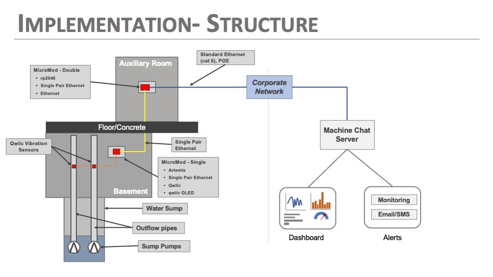

# SparkFun Single Pair Ethernet Table Top Demo

This demo project contains the firmware used for the Single Pair Ethernet table top demo kit.. The system uses single pair ethernet to communicate the status of the basement sump pumps in SparkFun's HQ building. 

The system consists of two SparkFun-based systems connected by Single Pair Ethernet. The structure of the system is:
* The first system uses accelerometers attached a pump "outflow" pipe to determine if the pumps are operating or not. This data is sampled at a constant rate.
* After each data sample, the sample results and pump state are packaged in a JSON formatted string and sent to board connected to the Single Pair Ethernet connection.
* The 2nd system is at the other end of the Single Pair Ethernet connection and receives the sent JSON data string. 
* When the 2nd system receives the JSON data from the sensor device, it then relays this data to the target IOT Server (MachineChat) via the attached Ethernet connection using a simple HTTP call.  

The structure of this demo is outlined in the following images:

## Source Arduino Sketches
The demo has two Sketches: 
* [spe_sensor.ino](spe_sensor/spe_sensor.ino) - the firmware for the sensor board
* [spe_relay.ino](spe_relay/spe_relay.ino) - the firmware for the relay board

## Demo Hardware
The following SparkFun boards were used for the demo

### Sensor Board

* [SparkFun MicroMod SPE Function](https://www.sparkfun.com/products/19038)
* [SparkFun MicroMod Main Board Single](https://www.sparkfun.com/products/18575)
* [Single Pair Ethernet Cable 0.5 m](        https://www.sparkfun.com/products/19312)
* [SparkFun MicroMod Artemis Processor](     https://www.sparkfun.com/products/16401)
* [Triple Axis Accelerometer KX134](         https://www.sparkfun.com/products/17589)
* [Qwiic OLED Display (128 x 32)](           https://www.sparkfun.com/products/17153)
* [Qwiic Cables](                            https://www.sparkfun.com/products/15081)

### Relay Board

* [ SparkFun MicroMod Main Board Double]( https://www.sparkfun.com/products/18576)
* [ SparkFun MicroMod rp2030 Processor]( https://www.sparkfun.com/products/17720)
* [ SparkFun MicroMod Ethernet Function]( https://www.sparkfun.com/products/18708)
* [ SparkFun MicroMod SPE Function](   https://www.sparkfun.com/products/19038)